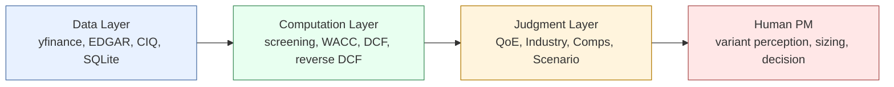
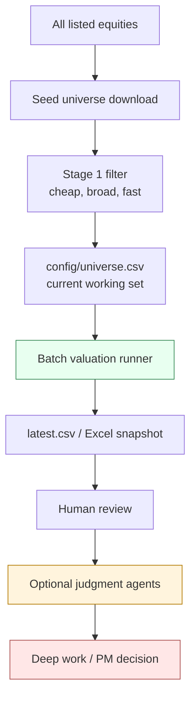
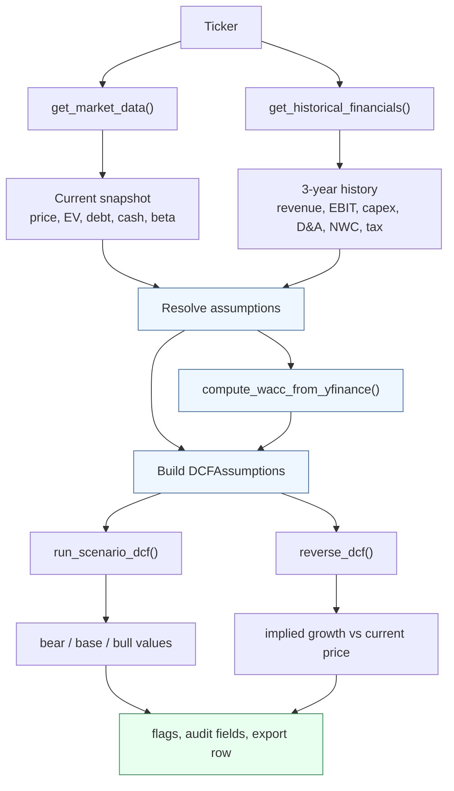
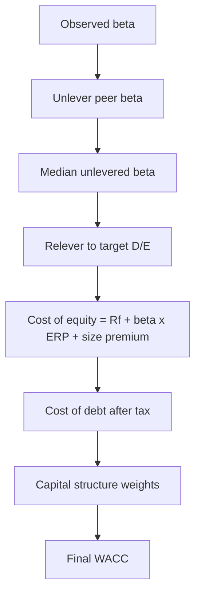
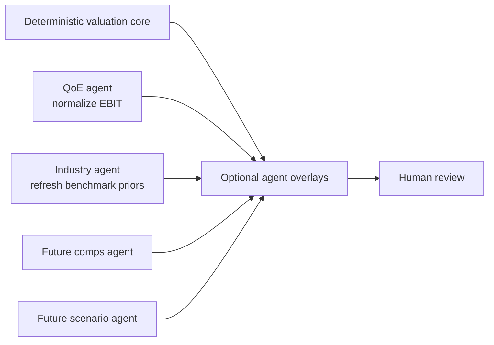

# Deterministic Valuation Workflow Deep Dive

This document is the operator manual for the Alpha Pod valuation pipeline.
It explains what happens, in what order, why each step exists, and what you should check when reviewing output.

It is intentionally detailed.
The target reader is the PM and system designer who wants to audit the logic rather than just run the scripts.

---

## 1. The Core Rule

Alpha Pod has three layers:

1. `Data layer` gathers facts.
2. `Computation layer` transforms those facts into valuation outputs.
3. `Judgment layer` adds interpretation, context, and challenge.

The non-negotiable rule is:

- `LLM agents never produce numbers that directly feed the DCF.`
- `Intrinsic values, WACC, and screening outputs must remain deterministic.`

That means:

- A market-data failure should degrade quality, not change the architecture.
- A model API outage should not stop the batch valuation engine.
- Any optional agent adjustment must be explicit, reviewable, and reversible.

---

## 2. The Full Workflow at a Glance

There are really two workflows:

1. `Universe workflow`: how the system moves from the broad market to a shortlist of names worth valuing.
2. `Valuation workflow`: how one ticker becomes a deterministic intrinsic value range.

The universe workflow is about narrowing attention.
The valuation workflow is about producing a reproducible answer with a clear audit trail.

---

## 3. Top-Level Task Breakdown

This is the practical operating sequence you can follow.
Each task is deliberately small enough to inspect without getting lost.

### A. Universe Preparation

1. Download or refresh the broad seed universe.
2. Pre-filter obvious non-candidates by market cap, sector, country, and liquidity.
3. Enrich survivors with yfinance data.
4. Apply quality filters.
5. Write the current working set to `config/universe.csv`.

### B. Deterministic Valuation Run

1. Load `config/universe.csv`.
2. For each ticker, fetch current market data.
3. Fetch historical financials.
4. Resolve assumptions with audit fields.
5. Compute WACC.
6. Run scenario DCF.
7. Run reverse DCF.
8. Compute warning flags.
9. Export ranked outputs to CSV and Excel.

### C. Human Review

1. Sort by upside, margin of safety, and warning flags.
2. Reject mechanically suspicious names first.
3. Review audit fields for fallback-heavy names.
4. Review sector comparability.
5. Escalate promising names to deeper work.

### D. Optional Judgment Layer

1. QoE agent checks whether reported EBIT is distorted by one-time items.
2. Industry agent refreshes sector benchmarks.
3. Comps agent ranks peer quality.
4. Scenario agent replaces generic stress cases with business-specific ones.

---

## 4. Single-Ticker Valuation Workflow

This section answers the question: `what exactly happens when one ticker enters value_single_ticker()?`

### Step 1: Fetch current market snapshot

Purpose:

- Get the present-day anchor for the valuation.
- Pull balance-sheet items needed for enterprise-to-equity conversion.

Key outputs:

- `current_price`
- `market_cap`
- `enterprise_value`
- `revenue_ttm`
- `operating_margin`
- `beta`
- `total_debt`
- `cash`
- `shares_outstanding`

What to check:

- Missing `revenue_ttm` means the ticker cannot be valued.
- Bad `shares_outstanding` or `enterprise_value` can distort reverse DCF.
- A stale or odd `operating_margin` should not be blindly trusted if historical data exists.

### Step 2: Fetch 3-year historical financials

Purpose:

- Replace single-period noise with a more stable operating history.
- Pull the data needed to derive assumptions rather than guess them.

Key series:

- Revenue
- Operating income
- Capex
- D&A
- NWC change
- Interest expense
- Effective tax rate

Derived outputs:

- `revenue_cagr_3yr`
- `op_margin_avg_3yr`
- `capex_pct_avg_3yr`
- `da_pct_avg_3yr`
- `nwc_pct_avg_3yr`
- `effective_tax_rate_avg`
- `cost_of_debt_derived`

What to check:

- Negative or unstable revenue CAGR.
- Very high capex or D&A percentages.
- Tax rates outside plausible bounds.
- Whether the historical signal is strong enough to beat sector defaults.

### Step 3: Resolve assumptions

Purpose:

- Convert raw facts into model inputs.
- Make the source of each input auditable.

Current precedence pattern:

1. Prefer historical 3-year averages when available and sane.
2. Fall back to TTM snapshot data.
3. Fall back to sector defaults.

This is the most important review step because assumption quality drives valuation quality more than arithmetic quality does.

What to check:

- `growth_source`
- `ebit_margin_source`
- `capex_source`
- `da_source`
- `tax_source`

Interpretation:

- Historical source = strongest.
- TTM source = usable but noisier.
- Sector default = fallback only; it is a warning, not a conclusion.

### Step 4: Compute WACC

Purpose:

- Translate business and capital structure risk into a discount rate.

Inputs:

- Beta
- Market cap
- Debt and cash
- Derived or default cost of debt
- Risk-free rate
- Equity risk premium
- Size premium

Outputs:

- `wacc`
- `cost_of_equity`
- `cost_of_debt_after_tax`
- `beta_unlevered_median`
- `beta_relevered`
- `equity_weight`
- `debt_weight`

What to check:

- Very high WACC often means small-cap risk, leverage, or unstable beta.
- Very low WACC can indicate over-trusting a low-beta snapshot or net cash balance.
- If peers are missing, self-beta fallback is fine, but lower confidence.

### Step 5: Build DCF assumptions

Purpose:

- Assemble one explicit structure that the DCF engine will use.

This includes:

- Revenue growth near term
- Revenue growth mid period
- Terminal growth
- EBIT margin
- Tax rate
- Capex percentage
- D&A percentage
- NWC drag
- WACC
- Exit multiple
- Net debt
- Shares outstanding

What to check:

- Are growth and margin assumptions internally consistent?
- Does the exit multiple make sense for the sector?
- Is terminal value becoming too dominant?

### Step 6: Run scenario DCF

Purpose:

- Produce a valuation range rather than a single fragile point estimate.

Current structure:

- `Bear`: lower growth, lower margins, higher WACC, lower exit multiple.
- `Base`: best current deterministic estimate.
- `Bull`: stronger growth, stronger margins, lower WACC, higher exit multiple.

Outputs:

- `iv_bear`
- `iv_base`
- `iv_bull`
- `upside_base_pct`
- `tv_pct_of_ev`

What to check:

- Base case should be plausible, not merely midpoint arithmetic.
- Bear case should represent a real downside path.
- Terminal value share of EV should not dominate without justification.

### Step 7: Run reverse DCF

Purpose:

- Ask what growth the current market price is already implying.

This is essential because a stock can look cheap in a forward model while still embedding aggressive expectations.

Output:

- `implied_growth_pct`

What to check:

- If implied growth is already near or above your base-case growth, the stock may not actually be mispriced.
- If implied growth is much lower than the historical or justified forward view, the name may deserve deeper work.

---

## 5. DCF Logic Broken Into Audit Chunks

This section breaks the model into very small reviewable units.

```mermaid
flowchart LR
    A["Revenue forecast"] --> B["EBIT forecast"]
    B --> C["NOPAT"]
    C --> D["Add D&A"]
    D --> E["Subtract capex"]
    E --> F["Subtract NWC change"]
    F --> G["Free cash flow"]
    G --> H["Discount cash flows"]
    H --> I["Add discounted terminal value"]
    I --> J["Enterprise value"]
    J --> K["Less net debt"]
    K --> L["Equity value"]
    L --> M["Divide by shares"]
    M --> N["Intrinsic value per share"]
```

### Chunk 1: Revenue forecast

Question:

- `What revenue path is the business likely to produce over the next 10 years?`

Mechanics:

- Years 1-5 use `revenue_growth_near`.
- Years 6-10 use `revenue_growth_mid`.

Review checklist:

- Does near-term growth reflect current business momentum?
- Is the fade from near-term to mid-term sensible?
- Is the path compatible with the industry growth ceiling?

### Chunk 2: EBIT forecast

Question:

- `What percent of revenue becomes operating profit before tax?`

Mechanics:

- `EBIT = Revenue * EBIT margin`

Review checklist:

- Is the margin based on history or fallback?
- Is the business at cyclical peak margins?
- Has QoE normalization been applied or not?

### Chunk 3: NOPAT

Question:

- `How much operating profit remains after tax?`

Mechanics:

- `NOPAT = EBIT * (1 - tax_rate)`

Review checklist:

- Is the tax rate stable and believable?
- Is the model using a normalized tax rate or a distorted one?

### Chunk 4: Non-cash add-back

Question:

- `What accounting expense reduced EBIT but did not consume cash in the period?`

Mechanics:

- Add back D&A.

Review checklist:

- Is D&A percentage reasonable for the business model?
- If D&A is too low, cash flow will look artificially weak.
- If D&A is too high, cash flow may be overstated.

### Chunk 5: Reinvestment drag

Question:

- `How much capital must the company reinvest to support growth?`

Mechanics:

- Subtract capex.
- Subtract NWC change.

Review checklist:

- Is capex structural or temporary?
- Is working capital consumption normal for the industry?
- Have inventory or receivables cycles recently distorted the historical averages?

### Chunk 6: Free cash flow

Question:

- `What cash is left for capital providers after sustaining and growing the business?`

Mechanics:

- `FCF = NOPAT + D&A - capex - NWC change`

Review checklist:

- Does FCF look directionally consistent with business economics?
- Is the model producing positive FCF only because assumptions are too generous?

### Chunk 7: Discounting

Question:

- `What is the present value of those future cash flows?`

Mechanics:

- Each year’s FCF is discounted by `WACC`.

Review checklist:

- Is WACC sensible for size, leverage, and cyclicality?
- Is discounting carrying too much of the valuation outcome?

### Chunk 8: Terminal value

Question:

- `What is the business worth after the explicit forecast period?`

Mechanics:

- Terminal EBIT times exit multiple.
- Discount terminal value back to present.

Review checklist:

- Is the exit multiple realistic for the company and sector?
- Does terminal value represent too much of enterprise value?
- If `tv_pct_of_ev` is high, are you really valuing the distant future rather than the actual business today?

### Chunk 9: Enterprise to equity bridge

Question:

- `How much of enterprise value belongs to equity holders after debt and cash?`

Mechanics:

- `Equity value = Enterprise value - net debt`

Review checklist:

- Is net debt correct?
- Is the company net cash and being penalized incorrectly?
- Is lease-like debt missing?

### Chunk 10: Per-share value

Question:

- `What is that equity worth per share outstanding?`

Mechanics:

- `Intrinsic value per share = Equity value / shares_outstanding`

Review checklist:

- Shares must reflect reality.
- Dilution risk matters.
- If shares are wrong, everything downstream is wrong.

---

## 6. How WACC Should Be Reviewed

WACC is often where model discipline quietly breaks.
Use this sequence when checking it:

1. Confirm whether peers were used or self-beta fallback was used.
2. Confirm net debt and market cap inputs.
3. Confirm size premium bucket.
4. Confirm derived cost of debt if available.
5. Confirm leverage weights.
6. Confirm after-tax cost of debt.
7. Confirm final WACC is directionally right for the business.

Red flags:

- No peers and unstable self-beta.
- Tiny WACC on a small or cyclical business.
- Huge WACC caused only by one noisy market input.
- Cost of debt stuck at default when actual debt servicing data exists.

---

## 7. How to Review Batch Output Like a PM

Do not start by looking at the biggest upside.
Start by filtering out the least trustworthy rows.

Recommended review order:

1. Filter names with missing or fallback-heavy assumptions.
2. Filter names where `tv_high_flag = True`.
3. Filter names with extreme implied growth mismatch.
4. Review WACC outliers.
5. Only then inspect top-upside candidates.

Why:

- Garbage-in can create impressive-looking upside.
- Many false positives come from weak assumptions, not from bad arithmetic.

Use this review checklist per ticker:

1. Is the revenue base correct?
2. Is growth source historical, TTM, or sector default?
3. Is EBIT margin sourced from history or a fallback?
4. Is capex realistic for the business model?
5. Is WACC directionally believable?
6. Is terminal value too dominant?
7. Is reverse DCF telling a contradictory story?
8. Does the final ranking still look interesting after those checks?

---

## 8. Where the New Agents Fit

These agents should be understood as overlays, not replacements.

### QoE Agent

Role:

- Read the 10-K.
- Identify non-recurring items.
- Normalize reported EBIT.

When it should matter:

- Restructuring charges
- Asset impairments
- Litigation
- Gains or losses on sales

What it should not do:

- Produce a valuation number
- Set discount rate
- Pick an intrinsic value

### Industry Agent

Role:

- Refresh sector and industry benchmark growth and margin assumptions weekly.

When it should matter:

- Sectors where hardcoded defaults are too stale.
- Industries with rapidly changing economics.

What it should not do:

- Override a strong company-specific historical signal by default.
- Replace deterministic model logic with narrative.

---

## 9. Manageable Work Chunks for Further Development

If you want to keep the next phase manageable, split it into these reviewable units.

### Industry Integration

1. Read benchmark cache from SQLite.
2. Add a precedence rule for benchmark overlays.
3. Log whether benchmark or sector default was used.
4. Re-run batch output.
5. Inspect only assumption-source changes first.

### QoE Integration

1. Add optional `--qoe` flag.
2. Run agent for one ticker only.
3. Compare reported vs normalized EBIT.
4. Check that only margin input changes.
5. Re-run DCF and compare impact.
6. Expand to a small basket.

### Comps Agent

1. Load candidate peer list.
2. Score business similarity.
3. Rank the best peers.
4. Feed peers into beta/WACC and exit-multiple review.
5. Compare result against self-beta baseline.

### Scenario Agent

1. Pull 10-K risks and recent news.
2. Name realistic scenarios.
3. Assign probabilities.
4. Map scenarios to growth and margin adjustments.
5. Replace generic bear/base/bull scalars.

---

## 10. Final Mental Model

The easiest way to picture the system is:

- `Screening` decides what deserves attention.
- `Valuation` decides what the business may be worth.
- `Agents` decide what context may improve or challenge that valuation.
- `You` decide whether the market is wrong and whether the bet is worth making.

If you remember only one thing, remember this:

`The DCF is not the thesis.`

The DCF is the numeric frame that keeps the thesis honest.
The thesis is still the human job.
