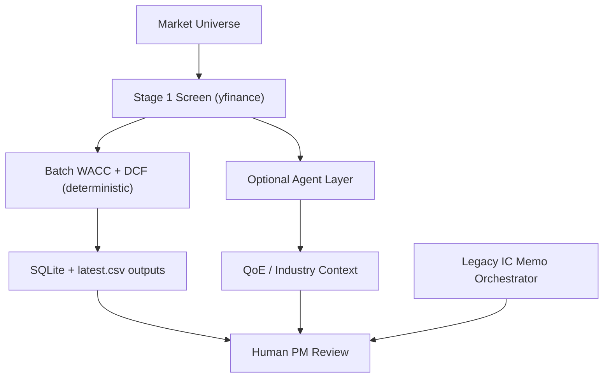

# Handbook Index

This handbook is the practical wiki for operating and extending Alpha Pod.

Use it for workflow guidance, local run paths, review loops, and implementation-adjacent usage notes. Finance-first valuation methodology lives in [`docs/valuation/`](../valuation/index.md).

## Use This When

- you want to run, review, or operate the system
- you need the practical workflow for a surface or subsystem
- you need an engineer-facing how-to instead of an architecture spec

## Read First

- [End-to-End Workflow](./workflow-end-to-end.md)
- [Operations Runbook](./operations-runbook.md)
- [Quality And Verification](./quality-and-verification.md)
- [Valuation And DCF Logic](./valuation-dcf-logic.md)

## For PMs And Operators

- [Finance Deep Dive](./finance-deep-dive.md)
- [Valuation Task Breakdown](./valuation-task-breakdown.md)
- [QoE Agent](./qoe-agent.md)
- [Deep Dive Dossier](./deep-dive-dossier.md)

## For Engineers And Contributors

- [Engineering Deep Dive](./engineering-deep-dive.md)
- [Local Dashboard Validation](./local-dashboard-validation.md)
- [Quote-Terminal UI And API Dev Guide](./quote-terminal-ui.md)
- [React Frontend Setup And Runtime Map](./react-frontend-setup.md)
- [React Playwright Review Loop](./react-playwright-review-loop.md)
- [WSL Playwright Fallback](./wsl-playwright.md)
- [Excel Template Guide](./excel-template-guide.md)
- [Accounting Recast](./accounting-recast.md)
- [Power Query M](./power-query-m.md)

## Mental Model

Alpha Pod has two analysis tracks in the repository:

1. Deterministic valuation track (recommended production path)

- Data ingest from yfinance/EDGAR/CIQ
- WACC + DCF + reverse DCF in pure Python
- Ranked outputs in SQLite + CSV

2. Full memo synthesis track (agent-heavy)

- Multi-agent IC memo orchestration in `src/stage_04_pipeline/orchestrator.py`
- Useful for narrative synthesis
- Not the authoritative path for deterministic intrinsic value ranking

## Non-Negotiable Invariant

LLM agents may explain or contextualize numbers, but they must not write numbers back into the deterministic compute path unless explicitly reviewed and accepted by a deterministic transform.

## Suggested Reading Order

1. End-to-end workflow (process map)
2. Valuation and DCF logic (how intrinsic value is computed)
3. Finance deep dive (how to interpret and challenge outputs)
4. Engineering deep dive (where to change code safely)
5. Runbook and verification (how to operate and release changes)
