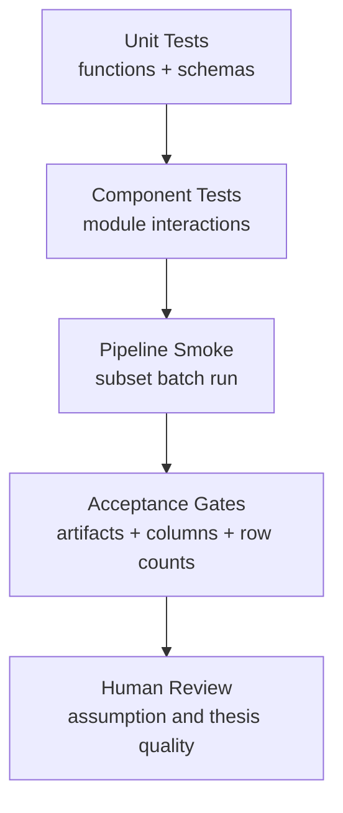

# Quality And Verification

This page maps what is tested today and what still needs stronger validation.

## Current Test Status

Latest local run:
- `python -m pytest -q`
- Result: `29 passed`

## Test Coverage Map

### Config loading
- `tests/test_config_loader.py`
- Verifies single YAML source behavior
- Verifies env override behavior
- Verifies `config.settings` shim parity

### Market data and historical derivations
- `tests/test_market_data.py`
- Validates `get_historical_financials()` structure and safety
- Includes mocked deterministic checks for CAGR, margin, capex sign, tax bounds

### Deterministic valuation storage behavior
- `tests/test_batch_runner_storage.py`
- Verifies `latest.csv` write path
- Verifies SQLite snapshot/history persistence
- Verifies optional Excel export invocation behavior

### DCF utility behavior
- `tests/test_valuation_pipeline.py`
- Includes reverse DCF plausibility check

### Agent contracts
- `tests/test_qoe_agent.py`
- Validates EDGAR 10-K helper behavior and truncation
- Validates QoE output schema and fallback path

- `tests/test_industry_agent.py`
- Validates weekly caching behavior
- Validates force-refresh behavior and persistence

### Base agent scaffolding
- `tests/test_base_agent.py`
- Confirms Anthropic tool schema format and initialization

## Verification Pyramid



## What Is Strong Today

- Core deterministic computations are explicit and reproducible.
- Batch storage and output contracts are tested.
- Newer agents (QoE and industry) have schema/cache tests.
- Config consolidation and runtime override behavior are tested.

## Gaps To Close Next

1. Deterministic integration coverage on real multi-ticker slices
- Add test harness that runs `run_batch()` on mocked small universes with richer edge cases.

2. Stronger regression checks for valuation output schema
- Add contract test that validates required columns and dtype expectations.

3. Acceptance tests for assumption-source quality distribution
- Example: enforce minimum share of `3yr_*` sourced assumptions before promoting output to production dashboard.

4. Guardrail tests for terminal value dominance
- Explicit tests around `tv_high_flag` threshold behavior.

5. Deterministic promotion rules for agent overlays
- If QoE/industry adjustments are applied in future compute flow, require deterministic transformation and tests.

## Recommended Release Gate

Before pushing valuation logic changes:

1. Run tests:
```bash
python -m pytest -q
```

2. Run sample deterministic batch:
```bash
python -m src.stage_02_valuation.batch_runner --limit 20 --top 10
```

3. Validate artifacts:
- `data/valuations/latest.csv` present
- `batch_valuations_latest` row count matches CSV
- Required columns present

4. Spot-check top 5 names:
- `growth_source`
- `ebit_margin_source`
- `tv_pct_of_ev`
- `implied_growth_pct`

## Definition Of Done For Valuation Changes

A valuation change is only done when:
- math logic is deterministic
- output schema is unchanged or intentionally versioned
- tests pass
- acceptance gates pass
- docs in handbook are updated
