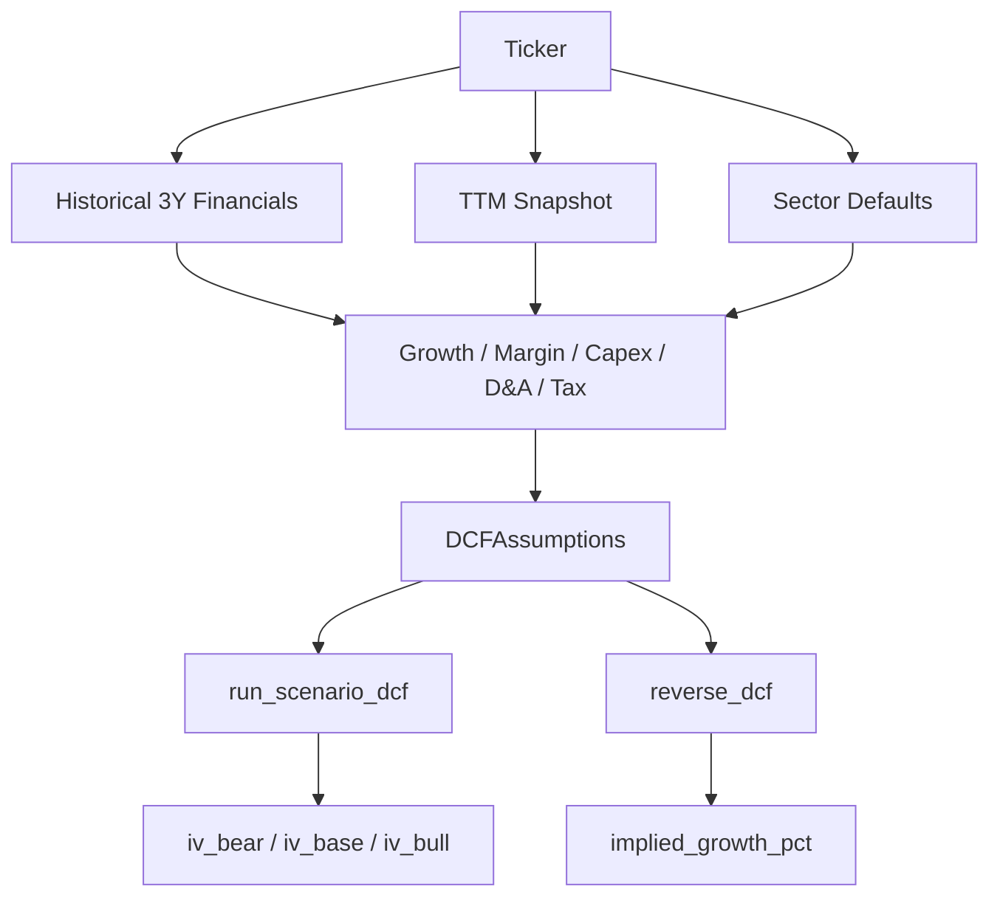

# Valuation And DCF Logic

This document is the source-of-truth explanation for how intrinsic value is computed in code.

Referenced modules:
- `src/stage_02_valuation/templates/dcf_model.py`
- `src/stage_02_valuation/wacc.py`
- `src/stage_02_valuation/batch_runner.py`

## 1. DCF Model Structure (10-Year Explicit Forecast)

The model in `run_dcf()` forecasts revenue for 10 years:

- Years 1-5 use `revenue_growth_near`
- Years 6-10 use `revenue_growth_mid`

Revenue recursion:

`Revenue_t = Revenue_(t-1) * (1 + g_t)`

where `g_t` is near or mid growth based on year.

## 2. Operating Forecast And Free Cash Flow

For each forecast year:

- `EBIT_t = Revenue_t * EBIT_Margin`
- `NOPAT_t = EBIT_t * (1 - Tax_Rate)`
- `D&A_t = Revenue_t * DA_pct`
- `Capex_t = Revenue_t * Capex_pct`
- `DeltaNWC_t = Revenue_t * NWC_pct`

Free cash flow:

`FCF_t = NOPAT_t + D&A_t - Capex_t - DeltaNWC_t`

## 3. Discounting

Present value of explicit forecast:

`PV_FCF = sum(FCF_t / (1 + WACC)^t) for t = 1..10`

Terminal value is exit-multiple based:

- `Terminal_EBIT = Revenue_10 * EBIT_Margin`
- `Terminal_Value_10 = Terminal_EBIT * Exit_Multiple`
- `PV_Terminal = Terminal_Value_10 / (1 + WACC)^10`

Enterprise and equity value:

- `EV = PV_FCF + PV_Terminal`
- `Equity_Value = EV - Net_Debt`
- `Intrinsic_Value_Per_Share = Equity_Value / Shares_Outstanding`

## 4. Scenario Engine (Bear/Base/Bull)

`run_scenario_dcf()` generates scenarios by perturbing base assumptions.

Bear transforms:
- near growth x 0.6
- mid growth x 0.6
- terminal growth x 0.7
- EBIT margin x 0.75
- capex pct x 1.2
- WACC + 2%
- exit multiple x 0.7

Bull transforms:
- near growth x 1.4
- mid growth x 1.3
- terminal growth x 1.1
- EBIT margin x 1.15
- capex pct x 0.9
- WACC - 1%
- exit multiple x 1.3

## 5. WACC Construction

WACC uses CAPM with beta unlevering/relevering in `src/stage_02_valuation/wacc.py`.

### 5.1 Unlevering peer beta

Hamada unlever formula:

`beta_unlevered = beta_levered / (1 + (1 - tax_rate) * D/E)`

Peer unlevered betas are filtered to sanity range and median is used.

### 5.2 Relevering to target structure

`beta_relevered = beta_unlevered_median * (1 + (1 - tax_rate) * D/E_target)`

### 5.3 Cost of equity

`Ke = Rf + beta_relevered * ERP + size_premium`

Defaults in code:
- `Rf = 4.5%`
- `ERP = 5.0%`
- size premium from market cap buckets

### 5.4 Cost of debt and capital weights

- `Kd_after_tax = cost_of_debt * (1 - tax_rate)`
- `E_weight = Equity / (Equity + Debt)`
- `D_weight = 1 - E_weight`

Final WACC:

`WACC = Ke * E_weight + Kd_after_tax * D_weight`

## 6. Reverse DCF (Implied Growth)

`reverse_dcf()` in `batch_runner.py` solves for near-term growth by binary search such that:

`Intrinsic_Value_Per_Share(g*) ~= Current_Price`

Search bounds:
- lower bound: -5%
- upper bound: +50%

Output:
- `implied_growth_pct`

Interpretation:
- High implied growth means market embeds aggressive expectations.
- Low implied growth means expectations are muted.

## 7. Assumption Sourcing Logic In Batch Runner

Assumptions are not one-size-fits-all. The code resolves with explicit priorities:

Key guardrails in code:
- Growth is bounded before use.
- Tax rate and capex/DA use plausible range checks.
- Missing history falls back to sector defaults rather than failing the full batch.

## 8. Quality Flags That Matter

The batch output includes practical diagnostics:
- `tv_pct_of_ev`: terminal value contribution to base EV
- `tv_high_flag`: true when terminal share > 75%
- source columns (`growth_source`, `ebit_margin_source`, etc.)

These fields should be reviewed before taking valuation ranks at face value.

## 9. DCF Review Checklist (Per Name)

1. Does base-case upside survive a bear-case stress?
2. Is WACC coherent with risk and size?
3. Is terminal value share acceptable?
4. Are growth and margins rooted in company history?
5. Is implied growth reasonable versus business reality?

## 10. Known Modeling Limits

Current deterministic implementation deliberately keeps complexity manageable.

Not yet modeled in deterministic core:
- Explicit multi-stage margin convergence curves
- Multi-factor macro regime discounting
- Dynamic buyback/share count paths
- Detailed working-capital driver decomposition by account

These can be added incrementally, but existing logic remains auditable and fast.

