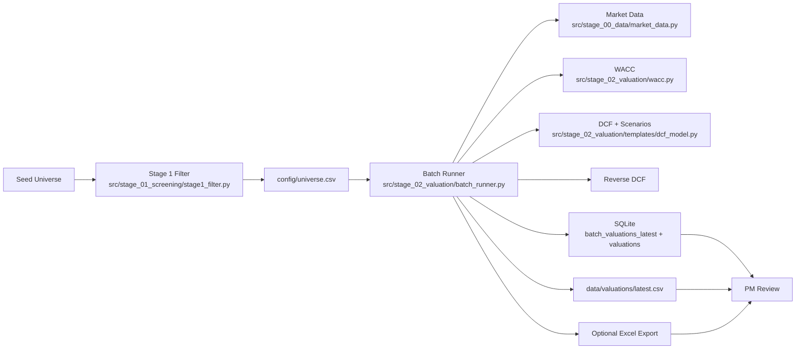

# End-to-End Workflow

This page explains the operational flow from ticker universe to reviewed valuation output.

## What The Pipeline Produces

Primary output artifacts:

- `data/alpha_pod.db` table `batch_valuations_latest` (canonical latest snapshot)
- `data/alpha_pod.db` table `valuations` (historical valuation metrics by date)
- `data/valuations/latest.csv` (flat export for Excel/Power Query)
- Optional `data/valuations/batch_valuation_YYYY-MM-DD.xlsx` when `--xlsx` is used

## High-Level Process

## Stage 1: Universe Filtering (Fast, Broad)

Entry point: `python -m src.stage_01_screening.stage1_filter`

Goal:

- Reduce initial listing universe to a manageable quality subset
- Keep filters broad enough to avoid dropping interesting names too early

Core filters in `src/stage_01_screening/stage1_filter.py`:

- Market cap band: $500M to $10B
- ROE floor: >= 12%
- Profitability: positive net income
- Liquidity: average volume threshold
- Exclusions: Financials, Utilities, Real Estate
- Geography: US bias

Design choices:

- Uses yfinance cache (`data/cache/yfinance_info.json`) to reduce API churn
- Applies fast pre-filter before yfinance calls to lower network cost
- Writes survivors to `config/universe.csv` for downstream deterministic valuation

## Stage 2: Deterministic Valuation Batch

Entry point: `python -m src.stage_02_valuation.batch_runner --top 50`

Per ticker sequence inside `value_single_ticker()`:

1. Pull market and financial snapshot (`get_market_data`)
2. Pull historical 3-year financial series (`get_historical_financials`)
3. Compute WACC using CAPM + unlevered/relevered beta (`compute_wacc_from_yfinance`)
4. Build DCF assumptions with source audit fields
5. Run base/bear/bull DCF
6. Run reverse DCF (implied growth at current price)
7. Emit one row with full assumptions + outputs + quality flags

## Assumption Source Priority (Per Ticker)

The deterministic layer uses explicit priority order:

- EBIT margin:
  1. 3-year average operating margin
  2. TTM operating margin
  3. Sector default

- Revenue growth:
  1. 3-year revenue CAGR (bounded)
  2. TTM revenue growth (bounded)
  3. Sector default

- Capex and D&A percentages:
  1. 3-year averages (within sanity bands)
  2. Sector defaults

- Tax rate:
  1. 3-year effective tax average (bounded)
  2. 21% US fallback

## Output Contract For Ranking

Every valuation row includes:

- Identity, sector, and core market metrics
- WACC decomposition fields
- Bear/base/bull intrinsic values
- Upside and margin-of-safety
- Assumption values and assumption sources
- Reverse DCF implied growth
- `tv_pct_of_ev` and `tv_high_flag` to detect terminal-value dominance

## Persistence And Consumption

`run_batch()` persistence behavior:

- Writes full latest snapshot to `batch_valuations_latest` (replace)
- Upserts normalized valuation history into `valuations`
- Writes `latest.csv` every run
- Optional multi-tab Excel for manual review

Operational logging behavior:

- `batch_runner.py` now routes lifecycle, warning, and export-path diagnostics through the shared CLI logging setup in `src/logging_config.py`
- the operator-facing summary remains concise, while `ALPHA_POD_LOG_FILE` can capture machine-readable JSON log lines for debugging and audit trails

Practical usage pattern:

- Use SQLite as system-of-record for analytics and automation
- Use `latest.csv` as convenience bridge to Excel review workflows

## Optional Judgment Layer

Judgment agents (`src/stage_03_judgment/`) consume deterministic outputs and external text context.

Current specialized modules:

- `qoe_agent.py`: normalize EBIT from 10-K text
- `industry_agent.py`: weekly sector benchmarks cached in SQLite

Guardrail:

- Agent outputs should be treated as contextual overlays unless promoted through a deterministic acceptance rule.

## Dashboard Shell

The Streamlit dashboard is the operator-facing review surface for the valuation workflow.

Current shell model:

- `Overview` for the cross-functional cockpit
- `Valuation` for DCF, comparables, and multiples
- `Market` for macro, revisions, sentiment, and factor context
- `Research` for the working research board and dossier-backed note blocks
- `Audit` for pipeline review, filings evidence, exports, and operational checks

The dossier companion is available as a right-side collapsible rail from loaded-ticker pages. Use the `Show Notes Rail` toggle in the shell header to open or close it without leaving the current analysis page.

## Legacy Full-Memo Path

`main.py` -> `PipelineOrchestrator` runs a 6-agent IC memo pipeline.

Use case:

- Narrative synthesis, thesis articulation, and decision memo drafting

Caution:

- This path is useful for research context but should not replace deterministic ranking outputs as the source of truth for intrinsic values.

## End-to-End Operator Checklist

1. Refresh/seed universe if needed
2. Run Stage 1 screen and inspect survivor count
3. Run batch valuation (`--top` and optional `--xlsx`)
4. Verify required output columns and coverage
5. Review highest-upside names with `tv_high_flag`, implied growth, and WACC reasonableness
6. Optionally overlay QoE/industry context for final PM judgment

