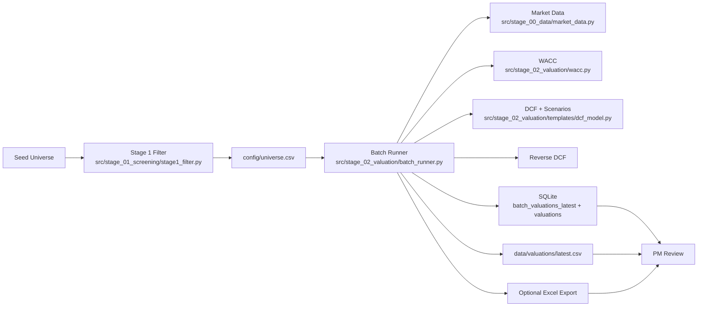

# End-to-End Workflow

This page explains the operational flow from ticker universe to reviewed valuation output.

## What The Pipeline Produces

Primary output artifacts:

- `data/alpha_pod.db` table `batch_valuations_latest` (canonical latest snapshot)
- `data/alpha_pod.db` table `valuations` (historical valuation metrics by date)
- `data/valuations/latest.csv` (flat export for Excel/Power Query)
- Optional `data/valuations/batch_valuation_YYYY-MM-DD.xlsx` when `--xlsx` is used

## High-Level Process



## Stage 1: Universe Filtering (Fast, Broad)

Entry point: `python -m src.stage_01_screening.stage1_filter`

Goal:

- Reduce initial listing universe to a manageable quality subset
- Keep filters broad enough to avoid dropping interesting names too early

Core filters in `src/stage_01_screening/stage1_filter.py`:

- Market cap band: $500M to $10B
- ROE floor: >= 12%
- Profitability: positive net income
- Liquidity: average volume threshold
- Exclusions: Financials, Utilities, Real Estate
- Geography: US bias

Design choices:

- Uses yfinance cache (`data/cache/yfinance_info.json`) to reduce API churn
- Applies fast pre-filter before yfinance calls to lower network cost
- Writes survivors to `config/universe.csv` for downstream deterministic valuation

## Stage 2: Deterministic Valuation Batch

Entry point: `python -m src.stage_02_valuation.batch_runner --top 50`

Per ticker sequence inside `value_single_ticker()`:

1. Pull market and financial snapshot (`get_market_data`)
2. Pull historical 3-year financial series (`get_historical_financials`)
3. Compute WACC using CAPM + unlevered/relevered beta (`compute_wacc_from_yfinance`)
4. Build DCF assumptions with source audit fields
5. Run base/bear/bull DCF
6. Run reverse DCF (implied growth at current price)
7. Emit one row with full assumptions + outputs + quality flags

## Optional CIQ Workbook Refresh Path

Entry point: `python -m ciq.ciq_refresh --ticker CALM --ciq-symbol NASDAQ:CALM`

This is the host-Windows Excel path for refreshing CIQ workbook data into SQLite.

Per ticker sequence:

1. Update `ciq/templates/financials_input.json` with the target CIQ symbol and date
2. Copy `ciq/templates/ciq_cleandata.xlsx` to `data/exports/{TICKER}_Standard.xlsx`
3. Open the staged workbook in desktop Excel via `xlwings`
4. Trigger workbook refresh and wait for async query completion
5. Save and close the workbook
6. Copy the refreshed staged workbook into `data/ciq_archive/` using ticker + date + timestamp
7. Run deterministic CIQ workbook ingest into SQLite

Important:

- this is separate from the Power Query JSON review path
- this should be run from host PowerShell, not WSL
- the safest operator path is passing `--ciq-symbol` explicitly when there is any doubt about exchange prefix

## Assumption Source Priority (Per Ticker)

The deterministic layer uses explicit priority order:

- EBIT margin:
  1. 3-year average operating margin
  2. TTM operating margin
  3. Sector default

- Revenue growth:
  1. 3-year revenue CAGR (bounded)
  2. TTM revenue growth (bounded)
  3. Sector default

- Capex and D&A percentages:
  1. 3-year averages (within sanity bands)
  2. Sector defaults

- Tax rate:
  1. 3-year effective tax average (bounded)
  2. 21% US fallback

## Output Contract For Ranking

Every valuation row includes:

- Identity, sector, and core market metrics
- WACC decomposition fields
- Bear/base/bull intrinsic values
- Upside and margin-of-safety
- Assumption values and assumption sources
- Reverse DCF implied growth
- `tv_pct_of_ev` and `tv_high_flag` to detect terminal-value dominance

## Persistence And Consumption

`run_batch()` persistence behavior:

- Writes full latest snapshot to `batch_valuations_latest` (replace)
- Upserts normalized valuation history into `valuations`
- Writes `latest.csv` every run
- Optional multi-tab Excel for manual review

Operational logging behavior:

- `batch_runner.py` now routes lifecycle, warning, and export-path diagnostics through the shared CLI logging setup in `src/logging_config.py`
- the operator-facing summary remains concise, while `ALPHA_POD_LOG_FILE` can capture machine-readable JSON log lines for debugging and audit trails

Practical usage pattern:

- Use SQLite as system-of-record for analytics and automation
- Use `latest.csv` as convenience bridge to Excel review workflows

## Optional Judgment Layer

Judgment agents (`src/stage_03_judgment/`) consume deterministic outputs and external text context.

Current specialized modules:

- `qoe_agent.py`: normalize EBIT from 10-K text
- `industry_agent.py`: weekly sector benchmarks cached in SQLite

Guardrail:

- Agent outputs should be treated as contextual overlays unless promoted through a deterministic acceptance rule.

## Agentic Handoff MVP Workflow

The valuation shell now includes a universal PM Queue / Insights path for judgment-agent handoffs.

Primary local operator runbook:

- [`docs/handbook/local-mvp-testing.md`](./local-mvp-testing.md)

Primary operator handbook:

- [`docs/handbook/agentic-handoff-mvp.md`](./agentic-handoff-mvp.md)

Shared loop:

```text
Evidence Packet -> Agent Observation -> Translator -> PM Decision Queue -> Preview/Edit/Approve -> Deterministic Rerun
```

Operational semantics:

1. Run one or more handoff profiles (`earnings_update`, `company_analysis`, `industry_analysis`, `comps_analysis`, `risk_review`, `valuation_review`).
2. Inspect generated Evidence Packets and anchored observations.
3. Review PM Decision Queue items:
   - advisory findings
   - assumption change packs
4. Use PM actions per item:
   - preview
   - edit
   - approve
   - reject
   - defer
5. On approve, queue items are linked into the existing pending/approved assumption path; only approved values flow into deterministic valuation inputs.

Guardrails:

- agents are analysts, not model mutators
- translator rules are deterministic policy
- PM is the only approval authority
- SQLite queue/evidence tables are canonical; exports are inspection copies only

Recommended first check before manual PM testing:

```powershell
rtk python scripts/manual/smoke_agentic_handoff_mvp.py --ticker IBM
```

By default the smoke script runs against a temporary SQLite snapshot and uses fixture-backed collector shims plus local stub observations, so it verifies queue safety without mutating the live review state.

For a single-command ticker review artifact, run:

```powershell
rtk python scripts/manual/run_ticker_valuation_flow.py --ticker IBM --skip-agent-runs
```

This writes a markdown and JSON packet under `output/ticker_flows/` with deterministic valuation, DCF scenarios, comps diagnostics, assumption-review flags, evidence/profile statuses, and PM Queue preview impact when queue items exist.

For a CIQ-backed daily ticker review, run the same flow with `--refresh-ciq` before agents run:

```powershell
rtk python scripts/manual/run_ticker_valuation_flow.py --ticker MSFT --refresh-ciq --ciq-symbol NASDAQ:MSFT --agent-mode heuristic --isolated-db
```

The CIQ preflight writes `ciq/templates/financials_input.json` for the workbook Power Query, opens the staged workbook, refreshes workbook connections/Power Query, waits for async queries, validates the refreshed workbook for ticker mismatch and CIQ pending/error cells, ingests the workbook, and then builds valuation payloads from the updated database. The output artifact records the exact `financials_input.json` payload and refresh/ingest result. If CIQ comps are unavailable, the comps dashboard may use a clearly flagged public-market fallback so the PM Queue remains testable, but CIQ absence remains visible in `audit_flags`.

If you refresh Excel manually, remember that the live S&P Capital IQ / Power Query data may be saved in the template workbook itself:

```text
ciq/templates/ciq_cleandata.xlsx
```

After manually refreshing and saving that workbook, ingest it intentionally before the valuation flow reads CIQ:

```powershell
rtk python scripts/manual/run_ticker_valuation_flow.py --ticker MSFT --ingest-ciq-template --agent-mode heuristic --profiles comps_analysis --isolated-db
```

The validated MSFT path on June 6, 2026 was: write `ciq/templates/financials_input.json` with `NASDAQ:MSFT`, manually refresh/save `ciq/templates/ciq_cleandata.xlsx`, ingest `ciq/templates`, then run the ticker flow. The resulting comps packet should show `source_quality=real` and source lineage like `source_file=ciq_cleandata.xlsx`.

The artifact separates persistent cache coverage from live evidence coverage. `EDGAR filing cache: 0 filings` means the SQLite cache table had no rows; `EDGAR evidence used this run` reports SEC source refs actually carried by evidence packets.

For a privacy-safe end-to-end handoff check that uses local deterministic heuristic observations instead of a live LLM, run:

```powershell
rtk python scripts/manual/run_ticker_valuation_flow.py --ticker IBM --agent-mode heuristic
```

For manual rehearsals, prefer `--isolated-db` so generated Evidence Packets and PM Queue items are written to a copied SQLite snapshot instead of the live operator queue. If SEC/Yahoo network access is unavailable but the repo already has cached filings and market rows, add `--edgar-cache-only --market-cache-only` to force local cache reads:

```powershell
rtk python scripts/manual/run_ticker_valuation_flow.py --ticker IBM --agent-mode heuristic --edgar-cache-only --market-cache-only --isolated-db
```

Treat heuristic queue items as workflow checks only. They are useful for verifying Evidence Packet -> Observation -> PM Queue -> Preview mechanics, but they are not investment-grade LLM insights.

To test live agents with an OpenRouter free model, first confirm that sending the ticker evidence packet to OpenRouter is acceptable for the ticker/data being reviewed, then run:

```powershell
rtk python scripts/manual/run_ticker_valuation_flow.py --ticker IBM --use-openrouter-free --openrouter-model openrouter/free
```

## Analyst Prep Pack MVP

Analyst Prep is the junior-analyst prework layer. It does not replace PM judgment or mutate the model. It gathers deterministic valuation state, evidence packets, PM Queue items, comps diagnostics, default-resolution warnings, and source lineage into one review packet.

## Guided Weekly Ticker Workup

For Milestone 1 weekly sessions, prefer the guided CLI when the PM wants a complete ticker workup with manual CIQ refresh, profile-by-profile analyst review, PM Decision Queue actions, and final artifacts:

```powershell
rtk python scripts/manual/run_guided_ticker_workup.py --ticker MSFT --ciq-symbol NASDAQ:MSFT
```

This is a live-agent, live-DB command by default. Use `--isolated-db` for rehearsal or when you want a disposable PM Queue/model review.

The command stages the CIQ workbook, pauses for manual Excel refresh/save, ingests the workbook, checks EDGAR filings, builds the deterministic valuation, runs each profile one at a time, and pauses after each profile for PM review. Approved queue items are previewed first and only applied after the PM types `APPLY`; inline target edits re-preview before approval.

Safe rehearsal command:

```powershell
rtk python scripts/manual/run_guided_ticker_workup.py --ticker MSFT --agent-mode heuristic --isolated-db --non-interactive --skip-ciq-stage --edgar-summary-only --market-cache-only --edgar-cache-only --no-export-xlsx
```

`--non-interactive` is for smoke tests. It skips queue decisions and does not ingest a staged CIQ workbook because no PM is present to refresh/save Excel. It never approves or applies assumption changes. Outputs land under `output/guided_workups/<TICKER>/`, and a friction-log draft is written under `docs/reviews/weekly-loop/`.

Primary command:

```powershell
rtk python scripts/manual/run_analyst_prep_pack.py --ticker IBM --agent-mode heuristic --isolated-db --export-xlsx
```

CIQ-backed manual-refresh command:

```powershell
rtk python scripts/manual/run_analyst_prep_pack.py --ticker MSFT --ingest-ciq-template --agent-mode heuristic --isolated-db --export-xlsx
```

The command writes JSON and Markdown under `output/analyst_prep/<TICKER>/`. With `--export-xlsx`, it also creates a ticker review workbook under `data/exports/generated/ticker/<TICKER>/...`.

By default, the command also runs the non-mutating `analyst_prep_synthesis` profile after the core profiles. It can add grounded observations from the prep payload, but it does not write model edits; PM Queue approval remains the only model-change path.

Website review path:

1. Start the local app with `scripts/manual/launch-mvp-app.ps1`.
2. Open `/ticker/<TICKER>/research`.
3. Review the `Analyst Prep` panel first:
   - thesis cards
   - model-driver map
   - missing-data flags
   - comps judgment
4. Use linked valuation tabs for driver review:
   - `wacc` -> WACC
   - `exit_multiple` -> Comparables
   - growth and margin fields -> Assumptions
5. Use the PM Queue approval path for any model changes. Analyst Prep cards are explanatory only.

Excel review sheets added by the ticker export:

- `Analyst_Prep`
- `Thesis_Bridge`
- `Model_Driver_Map`
- `Evidence_Map`
- `Comps_Judgment`
- `Segment_Drivers`

Current limitation: segment rows fail closed. If the pack says segment evidence is missing, do not infer segment mix-shift margin support until CIQ or SEC segment data is refreshed and parsed.

## Dashboard Shell

The Streamlit dashboard remains available as a transitional review surface for the valuation workflow.

Current shell model:

- `Overview` for the cross-functional cockpit
- `Valuation` for DCF, comparables, and multiples
- `Market` for macro, revisions, sentiment, and factor context
- `Research` for the working research board and dossier-backed note blocks
- `Audit` for pipeline review, filings evidence, exports, and operational checks
  - `Audit -> Batch Funnel` is the default no-memo landing surface and restores the latest saved deterministic universe watchlist on load.
  - The primary table is the full ranked universe watchlist with current price, scenario IVs, expected IV, analyst target, and latest archived PM stance metadata.
  - Deterministic batch refresh is manual. Use it to overwrite the saved watchlist from `config/universe.csv` or an ad hoc ticker subset.
  - Deep analysis stays explicit and cost-aware: open the latest archived snapshot for a ticker when it exists, or manually run deep analysis only for the focused ticker or selected shortlist when needed.

The dossier companion is available as a right-side collapsible rail from loaded-ticker pages. Use the `Show Notes Rail` toggle in the shell header to open or close it without leaving the current analysis page.

## Transitional UI Surfaces

Alpha Pod currently has two operator-facing shells during the quote-terminal migration:

- `dashboard/app.py`
  - Streamlit stabilization path
  - default no-memo landing remains `Audit -> Batch Funnel`
  - loaded tickers use a compact strip on non-`Overview` pages
  - `Valuation` now exposes `Assumptions`, `WACC`, and `Recommendations` as first-class visible subviews
- `frontend/`
  - React + TypeScript + Vite quote-terminal scaffold
  - strategic shell for the migration and the primary export surface
  - routes:
    - `/watchlist`
    - `/ticker/:ticker/overview`
    - `/ticker/:ticker/valuation`
    - `/ticker/:ticker/market`
    - `/ticker/:ticker/research`
    - `/ticker/:ticker/audit`
  - uses the thin FastAPI layer in `api/`
  - `Audit` is the canonical ticker export hub
  - `/watchlist` exposes explicit batch Excel and HTML export actions
  - `Valuation` and `Research` expose contextual export shortcuts

Local development commands:

```bash
python -m uvicorn api.main:app --reload
npm --prefix frontend run dev
python -m streamlit run dashboard/app.py
```

Migration guardrails:

- keep business logic in `src/stage_04_pipeline/`, `src/stage_03_judgment/`, and `src/stage_02_valuation/`
- keep `api/` as a transport layer only
- do not duplicate valuation logic in the frontend

## Legacy Full-Memo Path

`main.py` -> `PipelineOrchestrator` runs a 6-agent IC memo pipeline.

Use case:

- Narrative synthesis, thesis articulation, and decision memo drafting

Caution:

- This path is useful for research context but should not replace deterministic ranking outputs as the source of truth for intrinsic values.

## End-to-End Operator Checklist

1. Refresh/seed universe if needed
2. Run Stage 1 screen and inspect survivor count
3. Run batch valuation (`--top` and optional `--xlsx`)
   - dashboard alternative: `Audit -> Batch Funnel`, which auto-restores the latest saved watchlist before you refresh
4. Verify required output columns and coverage
5. Review highest-upside names with `tv_high_flag`, implied growth, and WACC reasonableness
6. Optionally overlay QoE/industry context for final PM judgment
