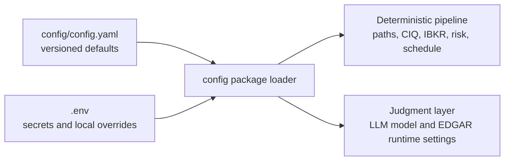
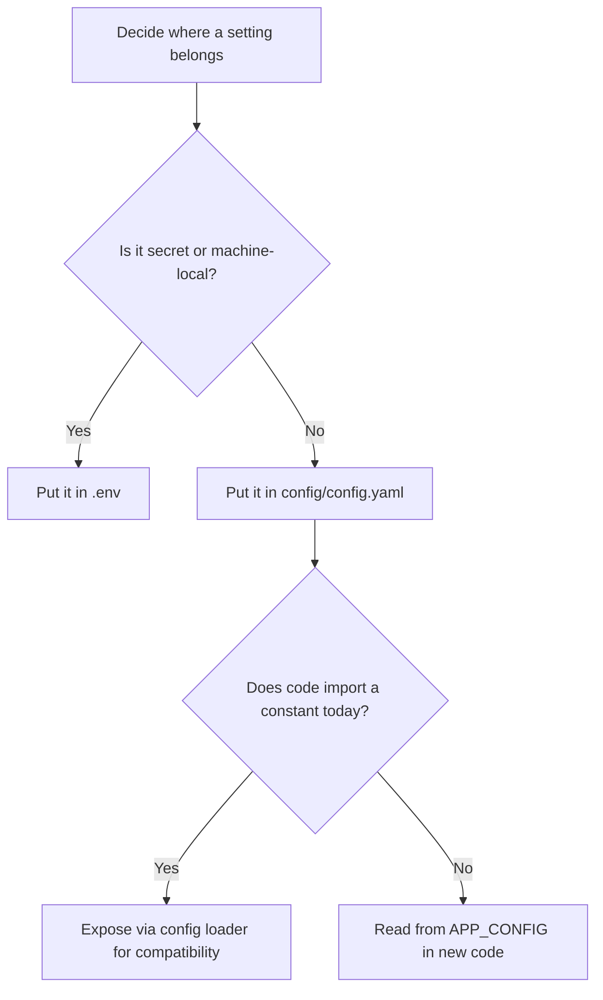

# Config Reference

This project now has one committed configuration file: `config/config.yaml`.

Use `.env` only for secrets and machine-local runtime overrides. If a setting should be reviewed, versioned, or discussed in a PR, it belongs in `config/config.yaml`.

## Mental Model





## File Roles

- `config/config.yaml`: single source of truth for committed project configuration.
- `.env`: secrets such as `GEMINI_API_KEY`, `GOOGLE_API_KEY`, `OPENAI_API_KEY`, `PERPLEXITY_API_KEY`, and `FRED_API_KEY`, plus optional local overrides for runtime values such as CLI logging.
- `config/__init__.py`: loader/facade. This is code, not an independent config source.
- `config/settings.py`: compatibility shim for older imports. New code should prefer `config` or `APP_CONFIG` directly.

## YAML Sections

### `paths`

Project-relative locations resolved against the repo root.

| Key | Meaning |
|---|---|
| `data_dir` | Base directory for local data artifacts |
| `db_path` | SQLite database path |
| `ciq_templates_dir` | CIQ Excel template directory |
| `ciq_exports_dir` | Export landing directory for CIQ pulls |
| `output_dir` | Root directory for generated outputs |
| `screens_dir` | Screen output folder |
| `memos_dir` | Memo output folder |
| `reports_dir` | Report output folder |
| `universe_path` | Stage 1 / batch universe CSV |

### `llm`

Model defaults used by the judgment layer.

| Key | Meaning |
|---|---|
| `model` | Primary model for standard agent runs |
| `fast_model` | Lower-cost / faster fallback model |

Supported local overrides in `.env`:
- `LLM_MODEL`
- `LLM_MODEL_FAST`

### Logging Overrides

These are machine-local runtime controls for CLI entry points that opt into `src/logging_config.py`.

| Env Var | Meaning |
|---|---|
| `ALPHA_POD_LOG_LEVEL` | Root CLI log level, default `INFO` |
| `ALPHA_POD_LOG_FILE` | Optional file path for JSON-formatted log lines |

### `portfolio`

Sizing defaults used by the risk agent and dashboard.

| Key | Meaning |
|---|---|
| `size_usd` | Base portfolio size for position sizing |
| `max_position_pct` | Maximum single-position weight |
| `conviction_multipliers.high` | Multiplier applied to `max_position_pct` for high conviction |
| `conviction_multipliers.medium` | Multiplier for medium conviction |
| `conviction_multipliers.low` | Multiplier for low conviction |

Derived values exported by the loader:
- `CONVICTION_SIZING["high"]`
- `CONVICTION_SIZING["medium"]`
- `CONVICTION_SIZING["low"]`

Supported local overrides in `.env`:
- `PORTFOLIO_SIZE_USD`
- `MAX_POSITION_PCT`

### `edgar`

Runtime settings for SEC access.

| Key | Meaning |
|---|---|
| `base_url` | SEC EDGAR base API URL |
| `user_agent` | Required User-Agent header string |
| `rate_limit_delay` | Delay between requests in seconds |

Supported local overrides in `.env`:
- `EDGAR_BASE_URL`
- `EDGAR_USER_AGENT`
- `EDGAR_RATE_LIMIT_DELAY`

### `ibkr`

Interactive Brokers connection defaults.

| Key | Meaning |
|---|---|
| `host` | TWS / Gateway host |
| `port` | TWS / Gateway port |
| `client_id` | IBKR API client ID |

### `ciq`

Capital IQ refresh and batching settings.

| Key | Meaning |
|---|---|
| `refresh_wait_sec` | Poll interval while waiting for CIQ recalculation |
| `refresh_timeout_sec` | Maximum wait before timing out CIQ refresh |
| `batch_size` | Names per CIQ template refresh |
| `drop_folder` | Live CIQ workbook export/drop directory used for refresh + ingest |
| `workbook_glob` | Workbook filename pattern scanned in the CIQ drop folder |

Important:
- `ciq.drop_folder` is for live CIQ workbook ingestion into SQLite.
- It should point at the export/drop directory, not `ciq/templates`.
- The Power Query Excel review path is separate and reads valuation JSON outputs, not CIQ workbooks.

### `risk_limits`

Hard portfolio-level and operational guardrails.

| Key | Meaning |
|---|---|
| `max_single_position_pct` | Max long position weight |
| `max_short_position_pct` | Max short position weight |
| `max_gross_exposure_pct` | Max gross exposure |
| `min_net_exposure_pct` | Minimum net exposure |
| `max_net_exposure_pct` | Maximum net exposure |
| `max_sector_concentration_pct` | Sector concentration cap |
| `stop_loss_review_pct` | Drawdown threshold that forces re-underwrite |
| `min_days_to_exit` | Liquidity threshold in days to exit |

### `screening_defaults`

Fallback thresholds used outside the richer screen definition.

| Key | Meaning |
|---|---|
| `min_market_cap_mm` | Minimum market cap in USD millions |
| `min_avg_daily_volume_mm` | Minimum daily dollar volume in USD millions |

### `schedule`

Operator-facing schedule defaults.

| Key | Meaning |
|---|---|
| `daily_refresh_time` | Daily pipeline run time |
| `weekly_screen_day` | Day of weekly screen run |
| `weekly_screen_time` | Weekly screen run time |

### `screening`

Full long and short rulebook. This is the old `screening_rules.yaml`, now embedded into the single config file.

Subsections:
- `long_screen.filters`
- `long_screen.scoring`
- `short_screen.filters`
- `short_screen.accounting_flags`
- `short_screen.scoring`

## How To Add A New Option

1. Decide if it is committed config or a secret/local override.
2. If committed, add it to the correct section in `config/config.yaml`.
3. If current code needs a constant import, expose it in `config/__init__.py`.
4. If legacy modules still import it from `config.settings`, re-export it there too.
5. Add or update a test in `tests/test_config_loader.py` if behavior changes.
6. Update this reference if the option is user-facing.

## Safe Examples

### Change the default fast LLM

```yaml
llm:
  model: claude-haiku-4-5-20251001
  fast_model: claude-haiku-4-5-20251001
```

### Tighten max position sizing

```yaml
portfolio:
  size_usd: 100000
  max_position_pct: 0.06
  conviction_multipliers:
    high: 1.0
    medium: 0.5
    low: 0.25
```

### Adjust long screen filter

```yaml
screening:
  long_screen:
    filters:
      min_market_cap_mm: 5000
```

## Guardrails

- Do not put API keys or tokens in `config/config.yaml`.
- Do not create a second committed YAML file for app config.
- Prefer extending an existing section before creating a new top-level section.
- Keep all paths project-relative inside the YAML.
- Keep deterministic compute settings separate from LLM judgment prompts and outputs.

